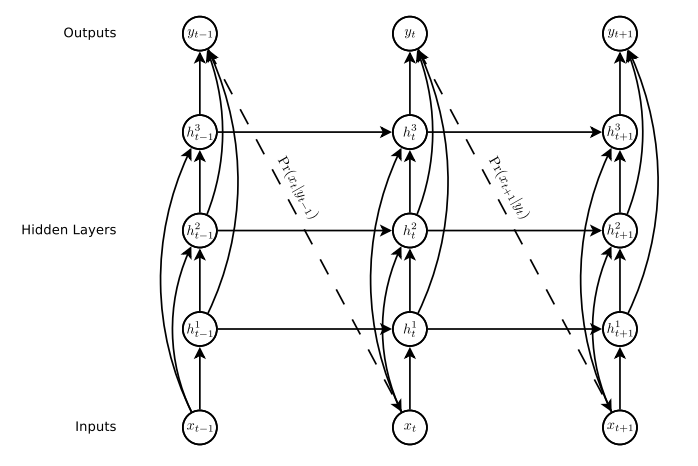

# Deep Learning Tricks

This is an attempt to enumerate different machine learning training tricks I gather around. The goal is to briefly give a description of the trick as well as an intuition about why it is working. My knowledge is quite limited so this is prone to errors/imprecisions. This should be a collaborative work so feel free to complete or correct. 
Most of the tricks may seems trivial for those who have some experience in machine learning but I feel like while there is a lot of very good theoretical material available for machine learning, there is still a lack of practical advice. Those would really have helped me when I started. 
The excellent [CS231n](http://cs231n.github.io/) Stanford course already has a good list of training tricks.

## Data prepossessing

## Initialisation

* **What**: Initializing the weights correctly can improve the performances and speed up the training. Bias usually initialized at 0. For the weights, some recommend using uniform within:
   * For linear layers \[1\]: [-v,v] with v = 1/sqrt(inputSize)
   * For convolution layers \[2\]: [-v,v] with v = 1/sqrt(kernelWidth\*kernelHeight\*inputDepth)

  Batch normalization \[3\] seems to reduce the need for fine tuned weight initialization. More recent results propose alternative formulas. 
  **Why**: Using the default initialization, each neurone has a variance that grows with the number of inputs. By scaling each weight by th sqrt(n), it ensure that the neurons will have approximately the same output distribution. 
  **Ref**:
    1. *Stochastic Gradient Descent Tricks, Leon Bottou*
    2. ?? (default used by Torch)
    3. *Batch Normalization: Accelerating Deep Network Training by Reducing Internal Covariate Shift, S. Ioffe and C. Szegedy* (https://arxiv.org/abs/1502.03167)

* **What**: For LSTM, initialize the forget bias to one. This speed up the training. 
  **Why**: The intuition is that at the beginning of the training, we want the information to propagate from cell to cell, so don't want the cell to forget its state. 
  **Ref**: *An Empirical Exploration of Recurrent Network Architectures, Rafal Jozefowicz et al.* (cites the trick but not the original authors)

* **What**: For t-SNE, the original author recommend a perplexity between 5 and 50 (for dataset with about 5000~10000 points) [1], for bigger dataset, it's recommended to use a bigger one. 
  **Why**: The perplexity determine the size of variance of the Gaussian distribution for each point. It can be seen as the number of affected nearest neighbors. A smaller perplexity will privilege local variations (more clusters), a big one will privilege the global ones. A perplexity bigger than the number of point don't really makes sense. 
  The other things to take into account is that the plotted clusters don't conserve their original scale (dense clusters will be diluted) and the distance between clusters isn't necessarily representative of the original spacial geometry. Different perplexity can gives complementary informations on the data structure, different runs can gives different results [2]. 
  **Ref**:
    1. *Visualizing High-Dimensional Data Using t-SNE, L.J.P. van der Maaten*
    2. *How to Use t-SNE Effectively, Wattenberg, et al., Distill, 2016.* ([link](http://distill.pub/2016/misread-tsne/))

## Training

* **What**: In addition to the ground truth 'hard' targets, we can also train a network using the soft targets (SoftMax outputs with high temperature (about 1-10 depending on the problem)) from another model. 
  **Ref**: *Distilling the Knowledge in a Neural Network / Dark knowledge, G. Hinton et al.* (https://arxiv.org/abs/1503.02531)

## Regularization

* **What**: To make Dropout works with RNN, it should only be applied on non-recurrent connections (between layers among a same timestep). 
  **Ref**: *Recurrent Neural Network Regularization, Wojciech Zaremba et al.* (https://arxiv.org/abs/1409.2329)

* **What**: Batch Normalization: adding a new normalization layer. The authors gives some additional tricks for accelerating BN Networks:
   * *Increase the learning rate*
   * *Remove/reduce Dropout*: speeds up training, without increasing overfitting.
   * *Remove/Reduce the L2 weight regularization*
   * *Accelerate the learning rate decay*: because the network trains faster.
   * *Remove Local Response Normalization*
   * *Shuffle training examples more thoroughly*: prevents the same examples from always appearing in a mini-batch together. (The authors speak about 1% improvements in the validation)
   * *Reduce the photometric distortions*

  **Why**: Some [good explanation](https://www.quora.com/Why-does-batch-normalization-help) 
  **Ref**: *Accelerating Deep Network Training by Reducing Internal Covariate Shift, S. Ioffe and C. Szegedy* (https://arxiv.org/abs/1502.03167)

## Network architecture

* **What**: Use skip connection. Directly connect the intermediate layers to the input/output. 
  **Why**: From the authors: "*make it easier to train deep networks, by reducing the number of processing steps between the bottom of the network and the top, and thereby mitigating the ‘vanishing gradient’ problem*" 
  **When**: Used in RNN if the number of layers is important or in some CNN architectures. 
  **Ref**: *Generating Sequences With Recurrent Neural Networks, Alex Grave et al.* (https://arxiv.org/abs/1308.0850)

 
*Example of skip connection on a RNN*

* **What**: Add peephole for LSTM (connect the previous output to the gate's inputs). According to the authors, it would help for long time dependencies when the timing is important. 
  **Ref**: *Learning Precise Timing with LSTM Recurrent Networks, Felix A. Gers et al.*

## Seq2seq

* **What**: For seq2seq, reverse the order of the input sequence (\['I', 'am', 'hungry'\] becomes \['hungry', 'am', 'I'\]). Keep the target sequence intact. 
  **Why**: From the authors: "*This way, [...] that makes it easy for SGD to “establish communication” between the input and the output. We found this simple data transformation to greatly improve the performance of the LSTM.*" 
  **Ref**: *Sequence to Sequence Learning with Neural Networks, Ilya Sutskever et al.* (https://arxiv.org/abs/1409.3215)

* **What**: For seq2seq, use different weights for the encoder and decoder networks. 
  **Ref**: *Sequence to Sequence Learning with Neural Networks, Ilya Sutskever et al.* (https://arxiv.org/abs/1409.3215)

* **What**: When training, force the correct input on the decoder (teacher forcing), even if the decoder predict a wrong output at the previous step. On testing, use. This make the training much efficient at the beginning. [2] propose an improvement by gradually going from a 'all decoder inputs taken from ground truth' to a 'all decoder inputs taken from previous step prediction' (randomly sampled with a chosen decay to gradually goes from one mode to the other). Seems harder to tune (add a few additional hyperparameters). 
  **Ref**:
    1. *??*
    2. *Scheduled Sampling for Sequence Prediction with Recurrent Neural Networks, Samy Bengio et al.* (https://arxiv.org/abs/1506.03099)

## Reinforcement learning

* **What**: Asynchronous: Train simultaneously multiple agents with different exploration policies (For instance E-greedy with different values of epsilon). Improve the robustness. On the paper, each agent regularly sample epsilon from a uniform bounded distribution. 
  **Ref**: *Asynchronous Methods for Deep Reinforcement Learning, V. Mnih* (https://arxiv.org/abs/1602.01783)

* **What**: Skip frame: Compute the action every 4 frames instead of every frames. For the other frames, repeat the action. 
  **Why**: Works well on Atari games, when the player reactivity doesn't need to be frame perfect. Using this trick allows to greatly speed up the training (About x4). 
  **Ref**: *Playing Atari with Deep Reinforcement Learning, V. Mnih* (https://arxiv.org/abs/1312.5602)

* **What**: History: Instead of only taking the current frame as input, stack the last frames together on a single input (size (h, w, c) with 1 grayscale frame by channel). Combined with a skip frame (repeat action) of 4, that means we would stack the frames t, t-4, t-8 and t-12. 
  **Why**: This allows the network to have some momentum information. 
  **Ref**: *Deep Reinforcement Learning with Double Q-learning, V. Mnih* (https://arxiv.org/abs/1509.06461)

* **What**: Experience Replay: Instead of updating every frames as the agent plays, to avoid correlations between the frames, it's better to sample a batch in the history of the transition taken (state, actionTaken, reward, nextState). This is basically the same idea as shuffling the dataset before training for supervised tasks. Some strategies exist to sample batches which contain more information (in the sense predicted reward different from real reward). 
  **Ref**: *Prioritized Experience Replay, Tom Schaul* (https://arxiv.org/abs/1511.05952)

## Network compression

* **What**: At inference, to reduce the number of layers, the batch normalization layers can be absorbed into the other weights by modifying those. This works because batch normalization simply perform a linear scaling at testing. 
  **Ref:**:*??*
